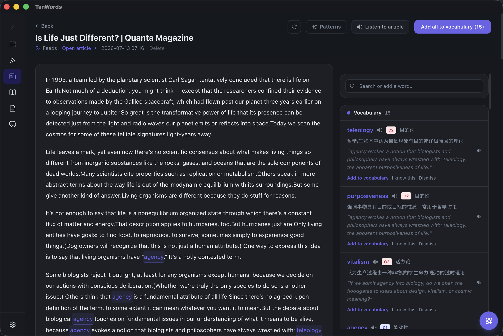
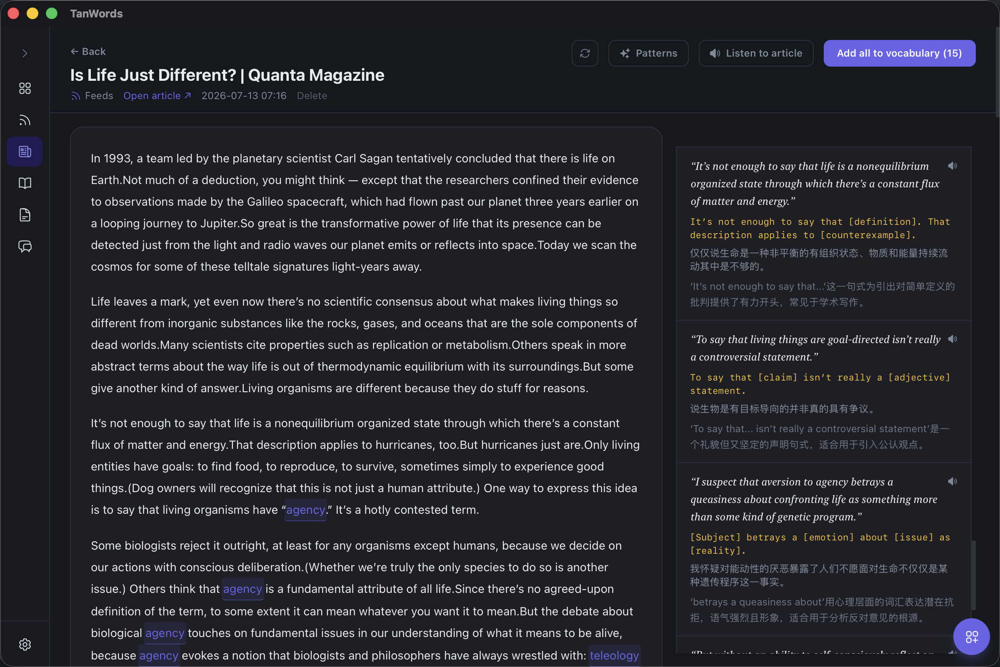
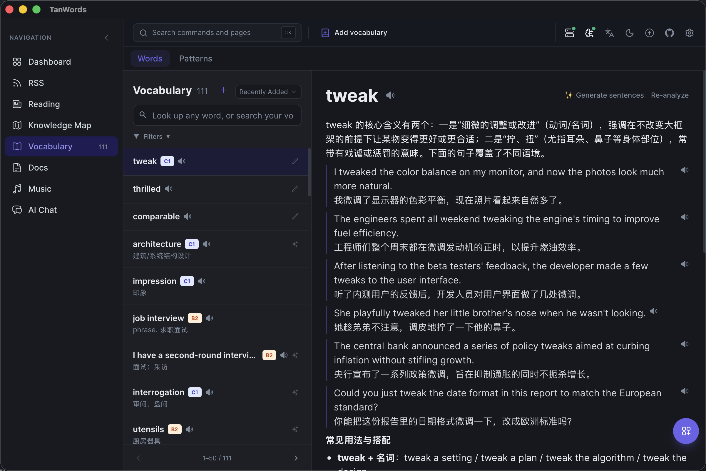
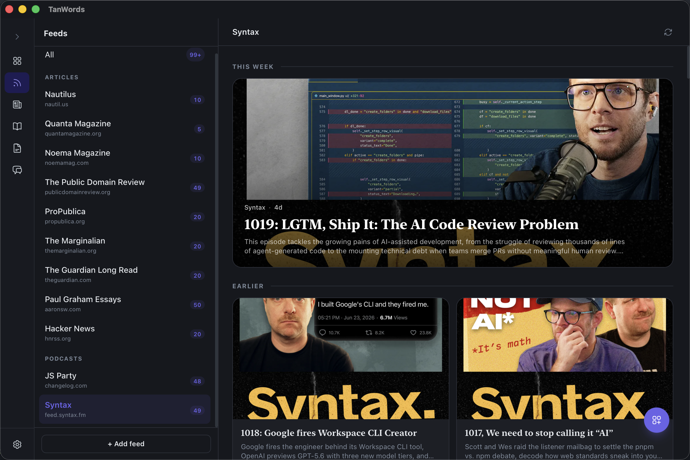
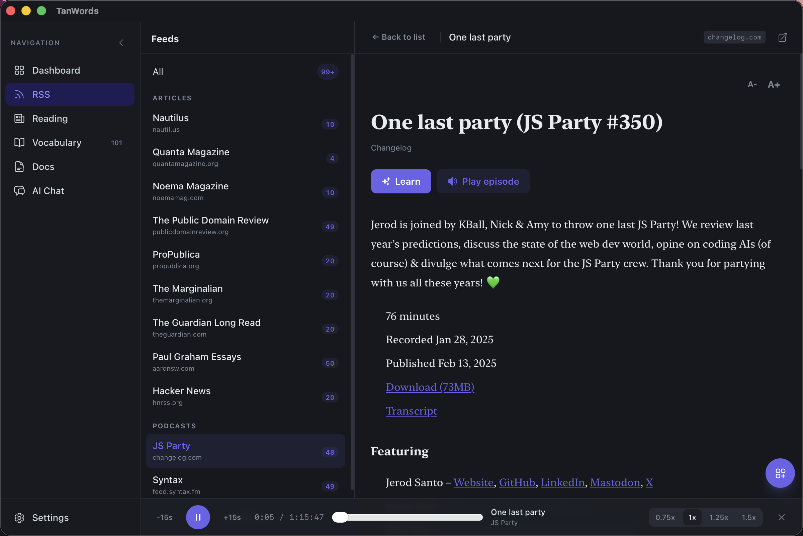
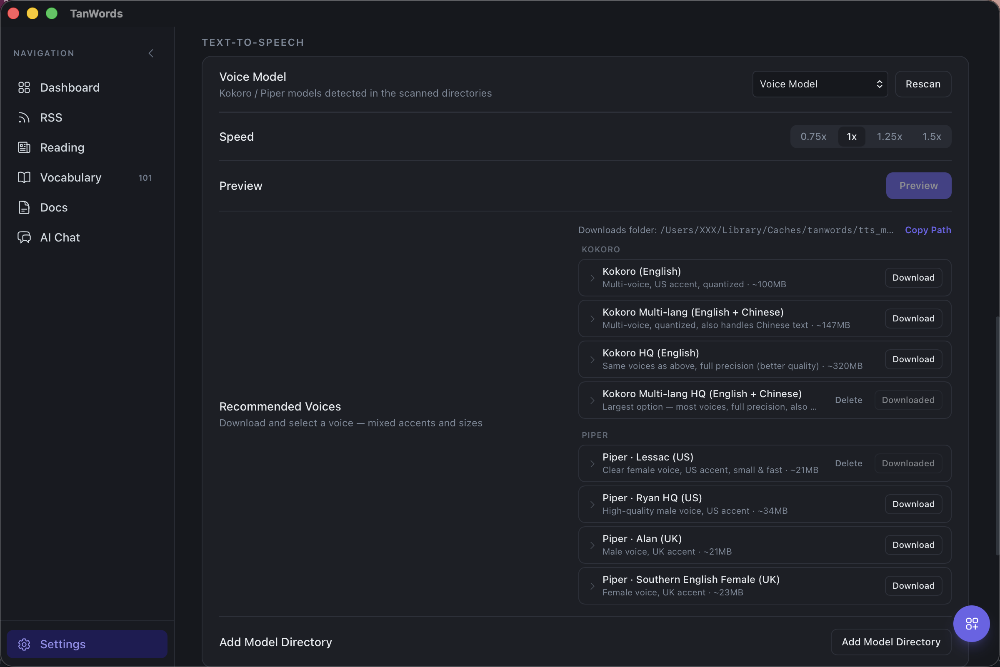
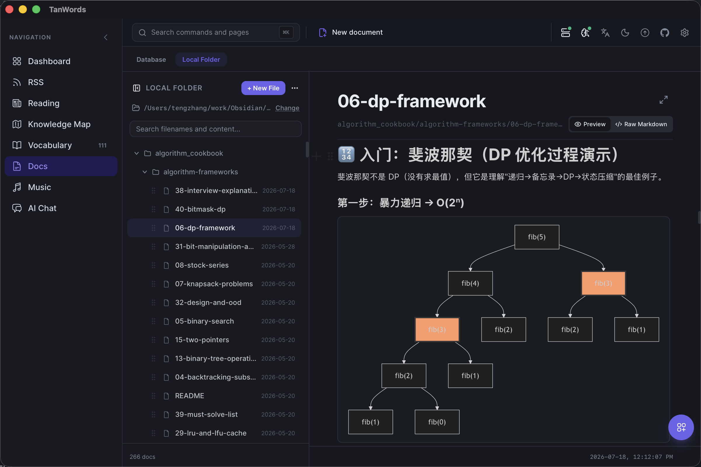

# TanWords

**English** | [简体中文](README.zh-CN.md)

A Tauri v2 desktop app for content-driven English vocabulary and sentence-pattern
learning, calibrated to CEFR C1/C2. The product loop: **read a real article → AI
extracts vocabulary and sentence patterns worth learning → accept into a personal
library → (vocabulary side only) FSRS spaced-repetition review.**

Primary UI language is Chinese; the codebase (identifiers, comments) is English.

## Screenshots

### Reading — extract vocabulary from any article

Paste an article (or pull one in from Feeds/HackerNews) and the AI extracts
CEFR-leveled vocabulary as you read, with one-click "add all to vocabulary" and
sentence-by-sentence "listen to article" playback via the embedded TTS engine.



The same article's sidebar also surfaces **sentence patterns** — reusable
skeletons with slots, explained in Chinese, backed by the real sentence they
came from:



### Vocabulary — full AI enrichment per word

Every word gets a freeform AI write-up (core meaning, common usage,
collocations, nuance vs. near-synonyms, etymology, memory aids) with 4-6+
real example sentences, plus a notes editor and a speak button on every
example.



### Feeds — RSS articles and podcasts in one place

Subscribe to article feeds and podcasts side by side; podcast episodes play
in a persistent bottom player bar.



Open an episode to read its show notes, jump straight into "Learn" (extract
vocabulary/patterns from the transcript, same as any article), or hit "Play
episode" to start it in the bottom player bar without leaving the page:



### Settings — on-device TTS voices

Scan local model directories or download recommended Kokoro/Piper voices
right from Settings, preview a voice before committing, and adjust playback
speed — all speech synthesis runs on-device, no network call at speak-time.



### Documents & AI Chat — always one click away

A floating tools button opens a draggable window with a personal notes
editor (BlockNote, full-text search, tags) and a multi-session AI chat —
available from any page without leaving what you're reading.




## Repo layout

```
app/     # The desktop app — React + TypeScript frontend, Rust/Tauri backend, SQLite DB.
         # See app/AGENT.md for the full architecture writeup.
admin/   # Standalone local admin tool for the same SQLite DB — table CRUD and
         # AI batch-generation (words/articles/patterns/documents), independent
         # of the desktop app. See admin/README.md.
```

## Stack

- **Frontend** (`app/`): React 18 + TypeScript + Tailwind + Zustand, Vite, BlockNote
  (document editor).
- **Backend** (`app/src-tauri/`): Rust, Tauri v2, `rusqlite` (SQLite, WAL mode).
- **Admin** (`admin/`): Node + Hono API + `better-sqlite3`, React/Vite web UI, plus a
  standalone CLI for unattended batch content generation.
- **AI**: bring-your-own-key, OpenAI-compatible providers (OpenAI, Anthropic/Claude,
  DeepSeek presets, or any local model via Ollama/LM Studio).
- **TTS**: embedded on-device speech synthesis via `sherpa-rs`/sherpa-onnx —
  Kokoro and Piper/VITS voices, no external binary or network call at speak-time.
  Downloadable voice models, pluggable model directories, sentence-by-sentence
  article playback, and per-word/example "speak" buttons throughout the app; falls
  back to the browser's `speechSynthesis` if no local model is loaded.
  Article playback is pipelined rather than batched: the model is preloaded at
  app startup (not on first use), only the sentence about to play is awaited,
  and the next couple of sentences are synthesized in the background while it
  plays. Synthesis itself runs off the async runtime on a dedicated blocking
  thread, so the UI stays responsive while sentences are generated.

## Feature pages

| Page | What it does |
|---|---|
| Dashboard | Resume an in-progress article, recent words/patterns/docs, quick actions. |
| Reading | Paste an article → AI extracts words + sentence patterns → accept individually or in bulk; click-any-sentence close reading; "listen to article" plays it back sentence-by-sentence with the embedded TTS engine, highlighting as it goes. |
| Feeds | Subscribe to RSS articles and podcasts side by side; browse HN, pull an article into Reading via an in-app reader or paste-back; the in-app reader also has "listen to article"; podcast episodes play in a persistent bottom player bar. |
| Knowledge Map | Enter any word, scene, or topic and build a persistent 2.5D map of related vocabulary and phrases; expand any branch progressively and add selected items to Vocabulary/FSRS. |
| Vocabulary | Master-detail word browser with full AI enrichment (freeform explanation, examples, collocations, etymology, mnemonics), FSRS review, time-range filtering (added/updated), and a speak button on every word/example. |
| Patterns | A parallel library for sentence patterns (skeleton + slots), tagged by rhetorical function, backed by real example sentences from the articles they came from. |
| Discover | Generate a themed vocabulary batch by topic, or explore a word family from a root/affix. |
| Documents | Personal notes editor (BlockNote), full-text search (SQLite FTS5), tags, pinning — also reachable from any page via the floating tools window. |
| AI Chat | Multi-session chat with tool-use that can write directly into the app's data — also reachable from any page via the floating tools window. |
| Settings | Provider config, CEFR target level, TTS voice model/speed (scan directories, download recommended Kokoro/Piper voices, add custom directories), switchable DB location, backup export. |

## Getting started

```bash
cd app && npm install && npm run tauri dev   # desktop app
cd admin && npm install && npm run dev       # admin tool (table browser + batch generate)
```

## Further reading

- [`app/AGENT.md`](app/AGENT.md) — full architecture, data access patterns, known
  gotchas, and conventions for the desktop app.
- [`admin/README.md`](admin/README.md) — admin tool setup, table browser, and the
  `generate-cli.mjs` batch-generation modes.
