# TanWords

**English** | [简体中文](README.zh-CN.md)

TanWords is a desktop app for content-driven English learning, built with Electron and a Rust sidecar. It is designed for advanced learners (CEFR C1/C2) around one loop:

> Read a real article -> AI extracts vocabulary and sentence patterns -> save the useful parts to a personal library -> review words with FSRS.

The UI is Chinese-first; the codebase is written in English.

## Web version

A browser-based edition (desktop + mobile, multi-user with invite-key registration and per-user Turso) lives in [`web/`](web/README.md): one Rust backend + Vite/React SPA. Quickstart in 3 lines:

```bash
cd web/frontend && bun install && bun run build
cd ../server && TANWORDS_MASTER_KEY=$(openssl rand -hex 32) TANWORDS_INVITE_KEY=choose-a-key cargo run --release
```

## Highlights

- **Learn from real content.** Paste an article, open an RSS feed, or read Hacker News inside the app. AI extraction works against the real text instead of a generic word list.
- **Deep word enrichment.** Each saved word gets a freeform AI write-up covering core meaning, usage, collocations, nuance versus near-synonyms, etymology, and memory aids, with real example sentences.
- **Sentence patterns as first-class items.** The Sentences/Patterns library stores reusable skeletons with slots, anchored to the real sentences they came from.
- **Reading, feeds, podcasts, and Hacker News in one place.** The built-in reader removes distractions, extracts vocabulary, reads articles aloud, and can open an episode in the persistent podcast player.
- **FSRS spaced repetition.** Vocabulary review is built in, so saved words can become a daily review queue.
- **Private by default.** Data lives in a local SQLite file. Optionally connect your own Turso database to sync across machines.
- **On-device TTS.** Kokoro/Piper voices run locally with no network call at speak time, including sentence-by-sentence article playback.
- **Documents and AI chat.** The sidebar includes a BlockNote document editor and a multi-session AI chat with tool use.

## Screenshots

### Dashboard

Resume an in-progress article, jump back into recent words, patterns, and documents, and reach every quick action from one home screen.

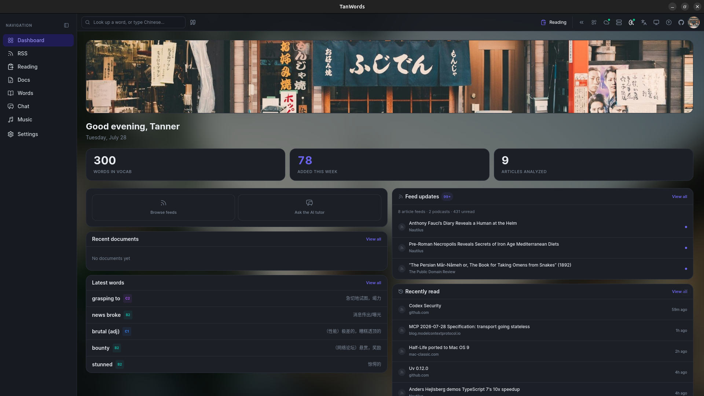

### Vocabulary and Sentence Patterns

Every word gets a full AI write-up, multiple real example sentences, a notes editor, and a speak button on each example. The list is built for scanning rather than endless scrolling.

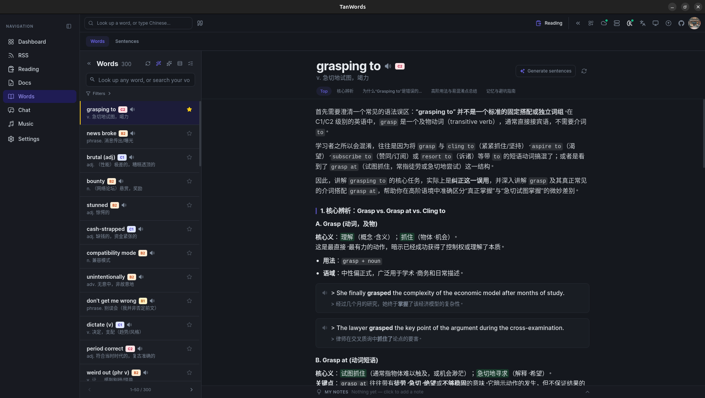

The Sentences tab is a parallel library of reusable sentence-pattern skeletons with slots, backed by the real sentence each pattern came from.

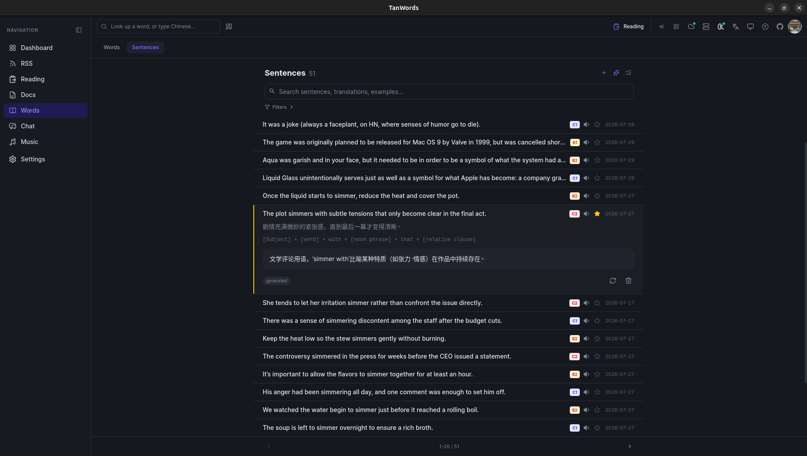

### Feeds, Podcasts, and the In-App Reader

Subscribe to article feeds and podcasts side by side. Podcast episodes play in a persistent bottom player bar.

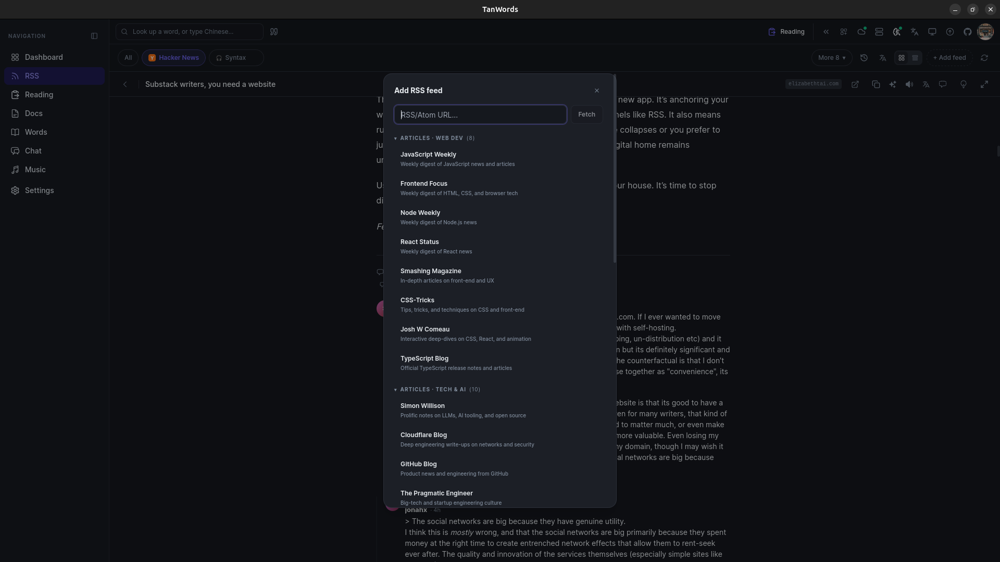

Open an entry in the in-app reader to read distraction-free, extract vocabulary and patterns directly from the page, or start a podcast episode without leaving the current view.

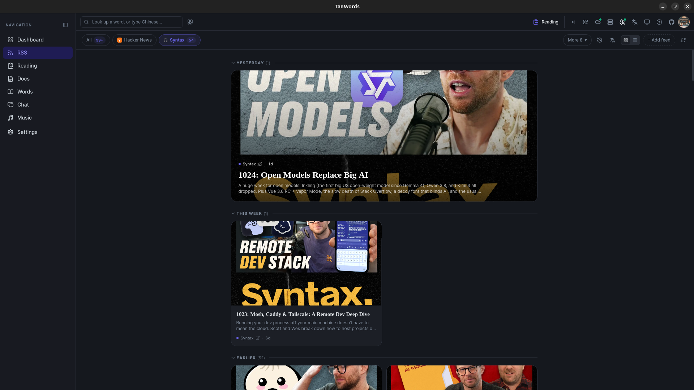

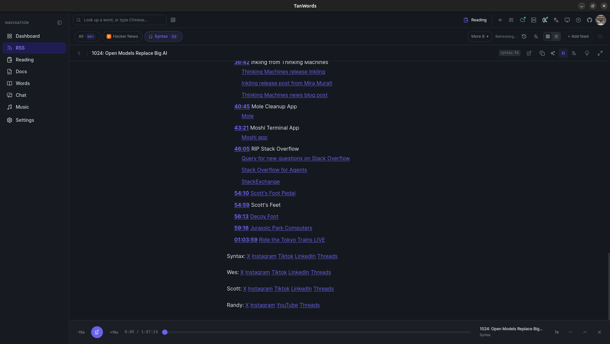

### Hacker News

Browse Top, New, and Best inside the app, then open a story with its full threaded comments and send it into Reading for vocabulary extraction.

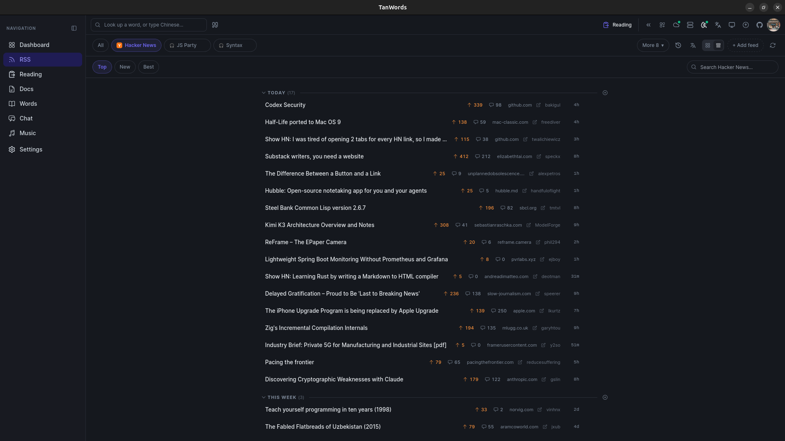

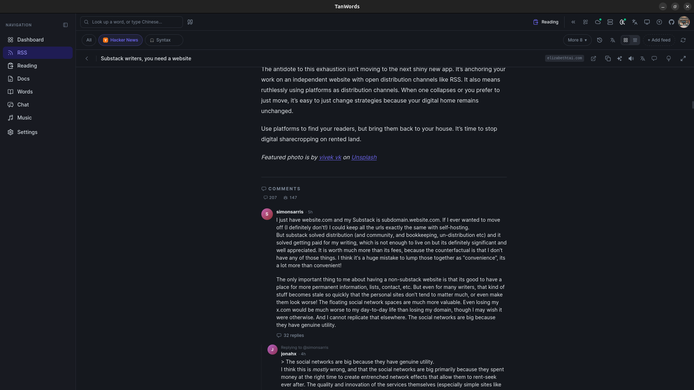

### Music

Browse local music by artist and album, play or shuffle a collection, and control the queue from the persistent player with seeking, playback speed, and track navigation.

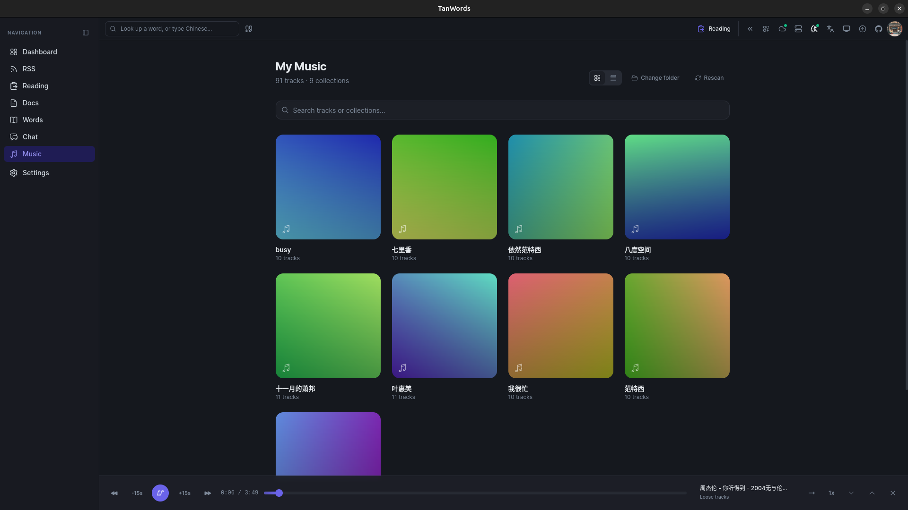

### Settings, TTS, and Data

Scan local model directories or download recommended Kokoro/Piper voices from Settings, preview a voice before committing, and adjust playback speed. All speech synthesis runs on-device.

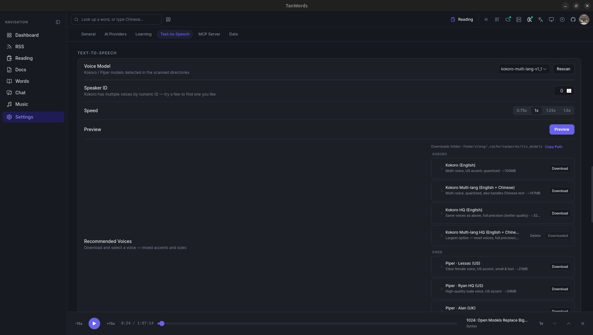

Connect your own Turso database to sync one vocabulary across machines, or stay fully local. Switch between the two anytime from Settings > Data.

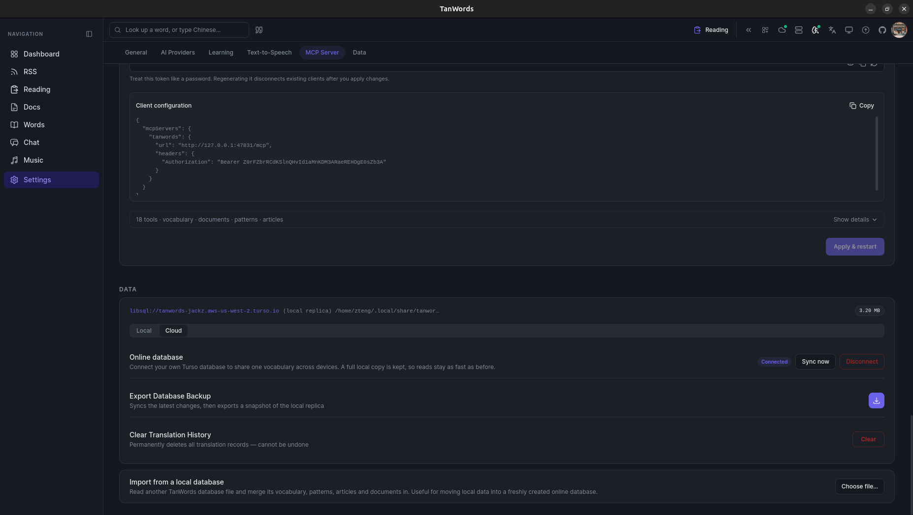

### Documents and AI Chat

Docs and AI Chat are first-class pages in the sidebar: a personal notes editor with full-text search and tags, plus a multi-session AI chat that can read and write app data through tools.

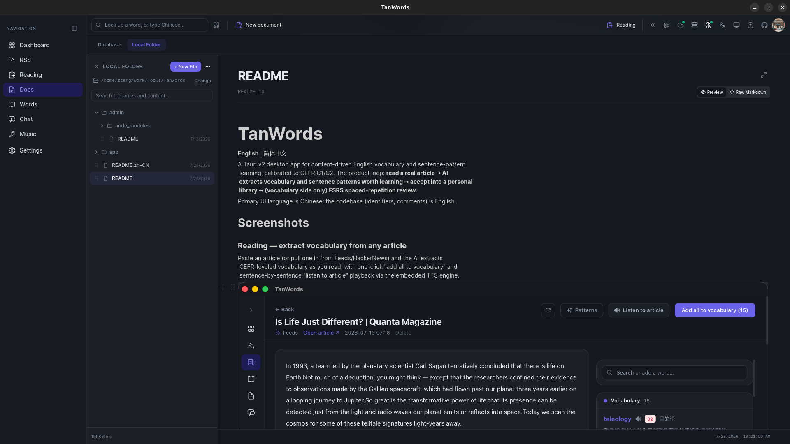

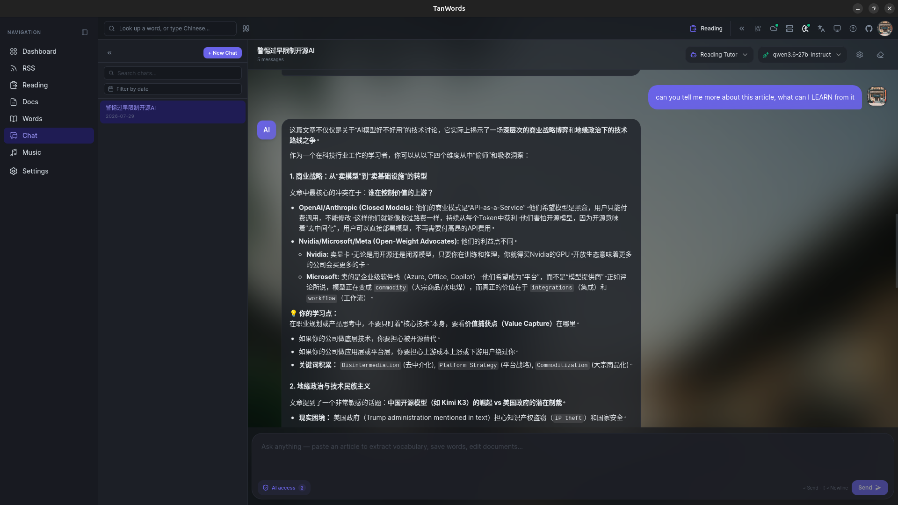

## Install

Download the latest `.dmg` from [Releases](https://github.com/FleetingEcho/TanWords/releases/latest). Choose the `-arm64` file on Apple Silicon and the unsuffixed file on Intel.

### macOS says "TanWords is damaged and can't be opened"

This is expected on first install, and the app is not damaged. The build carries an ad-hoc signature rather than a paid Developer ID signature, so macOS quarantines a browser-downloaded bundle and refuses to launch it. Two commands fix it permanently:

```bash
xattr -cr /Applications/TanWords.app
codesign --force --deep --sign - /Applications/TanWords.app
```

The second command prints `replacing existing signature`, which is normal. Run both. `xattr` alone only strips the quarantine flag; the bundle still needs to pass signature validation.

This setup is needed once. In-app updates download and verify their own archive instead of going through the browser, so later versions install without repeating these steps.

## Quick Start

You need [Bun](https://bun.sh) and a Rust toolchain.

```bash
cd app
bun install
bun run dev
```

`bun run dev` builds the Rust sidecar in debug mode, then starts Electron and Vite.

Useful commands:

```bash
bun run typecheck    # TypeScript across the renderer and Electron main
bun run test:run     # Vitest
bun run package:mac  # DMG + zip into dist-releases/
cd core && cargo test
```

> After a release build, `bun run dev` may prefer `core/target/release/tanwords-core` if it exists. Run `cargo build` again or remove the release binary so the dev app does not keep launching a stale sidecar.

## Feature Pages

| Page | What it does |
| --- | --- |
| Dashboard | Resume an in-progress article; recent words, patterns, and documents; quick actions. |
| Reading | Paste an article, extract words and sentence patterns with AI, accept items individually or in bulk, read sentence by sentence, and listen to the whole article with embedded TTS. |
| Feeds | Subscribe to RSS articles and podcasts side by side; browse Hacker News Top/New/Best with threaded comments; open articles in the in-app reader; play podcast episodes in the persistent player. |
| Knowledge Map | Build a persistent 2.5D map of related vocabulary and phrases from any word, scene, or topic; expand branches progressively; add selected items to Vocabulary/FSRS. |
| Vocabulary | Master-detail word browser with AI enrichment, examples, collocations, etymology, mnemonics, FSRS review, time-range filtering, and speak buttons. |
| Patterns | A parallel library for sentence patterns with slots, tagged by rhetorical function and anchored to real examples. |
| Discover | Generate a themed vocabulary batch by topic, or explore a word family from a root or affix. |
| Documents | BlockNote editor, SQLite FTS5 full-text search, tags, pinning, and document workflow tools. |
| AI Chat | Multi-session chat with tool use that can read and write app data. |
| Settings | AI providers, CEFR target level, TTS voice models and speed, database location, online sync, and backup/export. |

## Online Database (Optional)

By default, everything lives in one local SQLite file and no account is needed. To share one vocabulary across machines, connect your own Turso database in Settings > Data:

```bash
turso db create tanwords
turso db show tanwords --url          # -> libsql://... goes in "Database URL"
turso db tokens create tanwords       # -> token goes in "Auth token"
```

After connecting, the app keeps a full local replica, so reads stay local and offline reading still works. Writes are forwarded to your primary and synced in the background. The token is stored in the OS keychain and cannot be read back from the UI.

Appearance settings also live in the database. Against an empty online database they fall back to defaults, which can look like a reset, but your original local database is untouched and can be re-mounted anytime.

To move existing local data into an online database, use Settings > Data > "Import from a local database". The importer previews new and existing words, patterns, articles, and documents, lets you overwrite or skip each row, and applies the result in one transaction. Re-importing the same file changes nothing, and overwrites never touch FSRS review progress.

You can disconnect at any time. The current vocabulary is saved to a standalone local database file first, and nothing on the remote is touched. While offline, reads keep working from the local replica (marked read-only) and writes fail loudly instead of being silently lost.

The database belongs to your own Turso account; this project hosts nothing.

## AI Providers

Bring your own API key. TanWords includes OpenAI and Claude presets, a DeepSeek preset, and custom OpenAI-compatible endpoints such as Ollama or LM Studio.

Provider configuration lives in the database:

- **Keys are encrypted at rest** with AES-256-GCM under a master key held in the OS keychain. The renderer never reads the plaintext key directly.
- **Providers are scoped to the device that added them.** The device id is part of the primary key, so synced databases do not share provider credentials between machines.

## Architecture

TanWords uses a thin Electron shell and a statically linked Rust sidecar:

- **Renderer** (`app/src/`): React, TypeScript, Tailwind CSS, Zustand, Vite, and BlockNote.
- **Shell** (`app/electron/`): Electron main process and preload, handling windows, tray, the embedded browser panel, the updater, and sidecar lifecycle. It deliberately stays out of the data path.
- **Backend** (`app/core/`): Rust with `libsql` (SQLite in WAL mode). One API supports both a local database file and a Turso embedded replica.
- **IPC**: the renderer talks to the sidecar over a loopback HTTP API on an ephemeral port, gated by a bearer token passed through the preload handshake, with an SSE stream for events.
- **Commands**: Rust commands are annotated and a build script generates the dispatch table, so there is no hand-maintained router to drift out of sync.
- **TTS**: embedded `sherpa-onnx` voices run locally, with on-demand model loading, sentence-by-sentence article playback, and fallback to the browser speech engine.
- **Updater**: macOS releases are signed with ed25519 and verified before unpacking; Windows and Linux use `electron-updater`.

The codebase is organized to keep business logic out of Electron:

```
app/
  src/        # React + TypeScript renderer
  src/ipc/    # Typed client for the sidecar HTTP API and SSE events
  electron/   # Electron main process and preload
  core/       # Rust sidecar: data, AI, TTS, RSS, MCP server
docs/         # Feature and build notes
scripts/      # Release helpers
```

## Build and Release

macOS packaging:

```bash
cd app
bun run package:mac
```

Linux and Windows variants:

```bash
bun run package:linux
bun run package:win
```

Release outputs land in `dist-releases/`. macOS updater metadata is generated with:

```bash
node app/scripts/sign-release.mjs
```

## Further Reading

- [`docs/audio-player.md`](docs/audio-player.md) - audio playback internals.
- [`docs/build-windows.md`](docs/build-windows.md) - Windows build notes.
