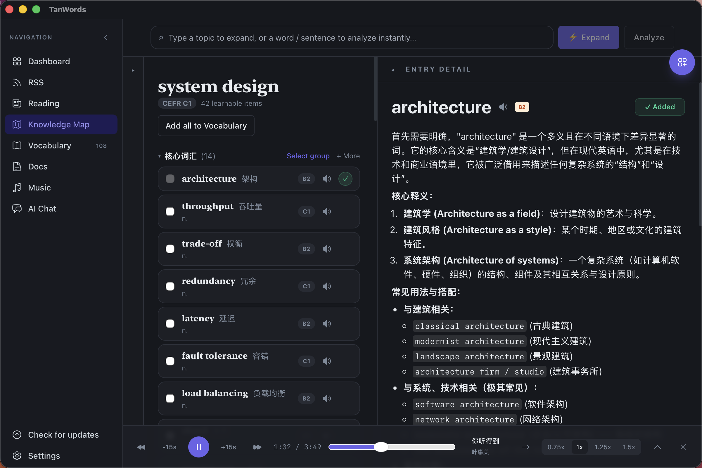
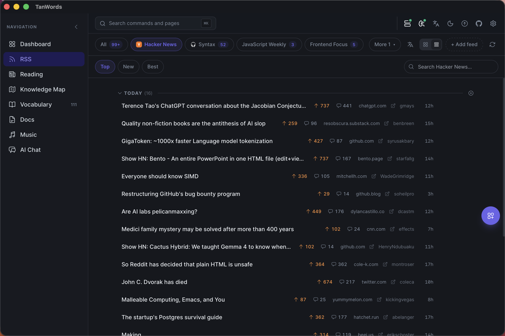
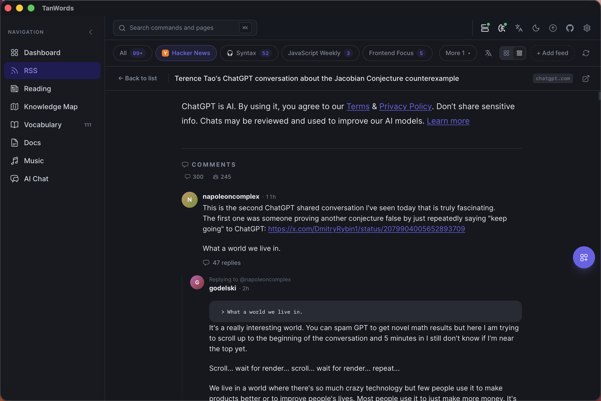
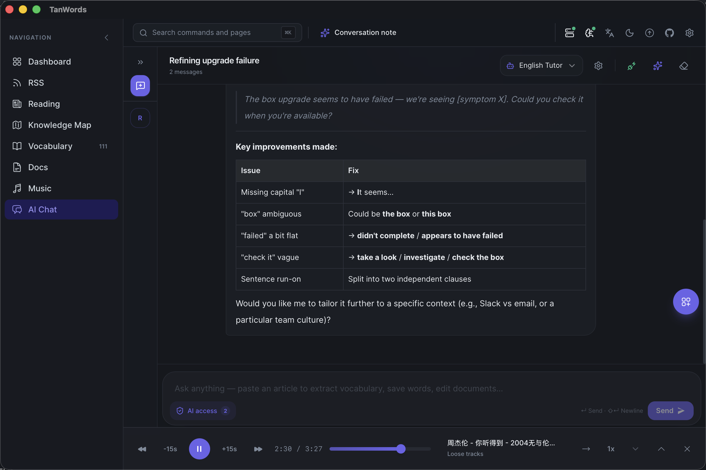

# TanWords

[English](README.md) | **简体中文**

一款基于 Tauri v2 的桌面应用，主打「以内容驱动」的英语词汇与句型学习，面向 CEFR
C1/C2 水平的学习者。产品闭环：**阅读一篇真实文章 → AI 提取值得学习的词汇和句型 →
收录进个人词库/句型库 → （词汇部分）用 FSRS 间隔重复复习。**

应用界面语言以中文为主；代码库本身（标识符、注释）使用英文。

## 截图

### Reading（阅读）—— 从任意文章中提取词汇

粘贴一篇文章（或从 Feeds/HackerNews 直接拉取），AI 会在你阅读的同时按 CEFR 等级
提取词汇，支持一键"全部加入词库"，也可以用内置 TTS 引擎逐句朗读全文并高亮跟读。


同一篇文章的侧边栏还会提取**句型（Sentence Patterns）**——可复用的骨架句式带
填空槽位，配中文讲解，并锚定在文章里真实出现的那句话上：


### 无限知识地图 —— 把任意主题展开成可学的词汇

输入一个主题，AI 会生成一张结构化的 CEFR 分级词汇/句型地图，可以继续探索
AI 生成的详细讲解，并把选中的条目——或整张地图——收录进个人词库。



### Vocabulary（词库）—— 每个单词都有完整的 AI 讲解

每个单词都会生成一段自由格式的中文讲解（核心释义、常见用法、搭配、与近义词的
细微差别、词源、记忆方法），配 4-6 条以上真实例句，并带笔记编辑器和逐条例句的
朗读按钮。


### Feeds（订阅）—— 文章和播客集中在一个地方

同时订阅文章类 RSS 源和播客；播客集会在底部常驻的播放条中播放。


打开一集播客可以查看节目简介、直接点击"Learn"从文字稿中提取词汇/句型
（和处理普通文章一样），或者点击"Play episode"直接在底部播放条播放，
不用离开当前页面：


### Hacker News —— 内置阅读器，不用切浏览器

直接在应用内浏览 Top/New/Best：



打开任意一条帖子，连同完整的楼中楼评论一起阅读，也可以直接送入 Reading
提取词汇和句型：



### Settings（设置）—— 本机 TTS 语音模型

在设置页里扫描本地模型目录，或者直接下载推荐的 Kokoro/Piper 音色，下载前
可以先试听，还能调整朗读语速——所有语音合成都在本机完成，朗读时不产生
任何网络请求。


### Documents 与 AI Chat —— 侧边栏中的一等页面

Docs 和 AI Chat 就在左侧导航栏里：个人笔记编辑器（BlockNote、全文搜索、
标签）和多会话 AI 对话，从应用任意位置一键直达。




## 仓库结构

```
app/     # 桌面应用 —— React + TypeScript 前端，Rust/Tauri 后端，SQLite 数据库。
         # 完整架构说明见 app/AGENT.md。
admin/   # 独立的本地管理工具，操作同一个 SQLite 数据库 —— 表格 CRUD 和
         # AI 批量生成（单词/文章/句型/文档），与桌面应用相互独立。
         # 见 admin/README.md。
```

## 技术栈

- **前端**（`app/`）：React 18 + TypeScript + Tailwind + Zustand，Vite，BlockNote
  （文档编辑器）。
- **后端**（`app/src-tauri/`）：Rust，Tauri v2，`rusqlite`（SQLite，WAL 模式）。
- **管理工具**（`admin/`）：Node + Hono API + `better-sqlite3`，React/Vite 网页界面，
  外加一个用于无人值守批量生成内容的独立 CLI。
- **AI**：自带 API Key，兼容 OpenAI 接口的任意服务商（OpenAI、Anthropic/Claude、
  DeepSeek 预设，或通过 Ollama/LM Studio 接入的任意本地模型）。
- **TTS**：通过 `sherpa-rs`/sherpa-onnx 实现的本机嵌入式语音合成 —— 支持
  Kokoro 和 Piper/VITS 音色，朗读时不依赖外部二进制或网络请求。支持下载语音
  模型、自定义模型目录、逐句朗读全文，以及贯穿全应用的单词/例句朗读按钮；
  未加载本地模型时会回退到浏览器自带的 `speechSynthesis`。
  文章朗读采用流水线而非整篇批量合成：模型在应用启动时就预加载好（而不是等
  第一次朗读时才加载），播放时只等待"即将播放的这一句"，接下来的几句在后台
  提前合成；合成过程本身跑在独立的阻塞线程上，不占用异步运行时，朗读时界面
  不会卡顿。

## 功能页面

| 页面 | 功能说明 |
|---|---|
| Dashboard（仪表盘） | 继续阅读未完成的文章，查看最近的单词/句型/文档，快捷操作入口。 |
| Reading（阅读） | 粘贴文章 → AI 提取单词和句型 → 可单条或批量收录；点击任意句子进入沉浸式阅读；"朗读全文"用内置 TTS 引擎逐句播放并高亮跟读。 |
| Feeds（订阅） | 同时订阅文章类 RSS 源和播客；应用内浏览 Hacker News（Top/New/Best，含完整楼中楼评论）；通过应用内阅读器或粘贴方式把文章导入 Reading；应用内阅读器同样支持"朗读全文"；播客集在底部常驻播放条中播放。 |
| 无限知识地图 | 输入任意单词、场景或主题，生成可永久保存的 2.5D 词汇地图；任意分支都能渐进展开，并可将所选词汇加入词库/FSRS。 |
| Vocabulary（词库） | 主从式单词浏览界面，配完整 AI 讲解（自由格式讲解正文、例句、搭配、词源、记忆法）、FSRS 复习、按添加/更新时间筛选，以及每个单词/例句的朗读按钮。 |
| Patterns（句型库） | 与词库并行的句型库（骨架句式 + 填空槽位），按修辞功能打标签，例句均来自真实收录的文章。 |
| Discover（发现） | 按主题批量生成一组词汇，或从词根/词缀出发探索一个词族。 |
| Documents（文档） | 个人笔记编辑器（BlockNote）、全文搜索（SQLite FTS5）、标签、置顶。 |
| AI Chat（AI 对话） | 支持工具调用、可直接读写应用数据的多会话对话。 |
| Settings（设置） | AI 服务商配置、CEFR 目标等级、TTS 音色/语速（扫描目录、下载推荐的 Kokoro/Piper 音色、添加自定义目录）、可切换的数据库位置、备份导出。 |

## 快速开始

```bash
cd app && npm install && npm run tauri dev   # 桌面应用
cd admin && npm install && npm run dev       # 管理工具（表格浏览器 + 批量生成）
```

## 延伸阅读

- [`app/AGENT.md`](app/AGENT.md) —— 桌面应用的完整架构说明、数据访问方式、
  已知坑点和开发约定。
- [`admin/README.md`](admin/README.md) —— 管理工具的搭建方式、表格浏览器，以及
  `generate-cli.mjs` 的各种批量生成模式。
